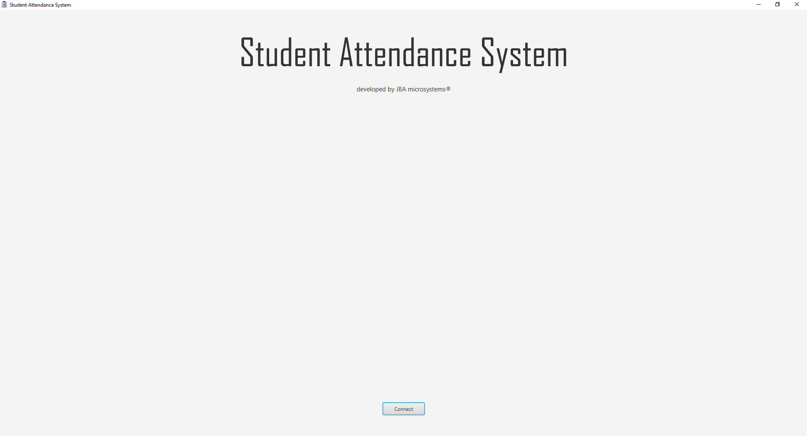
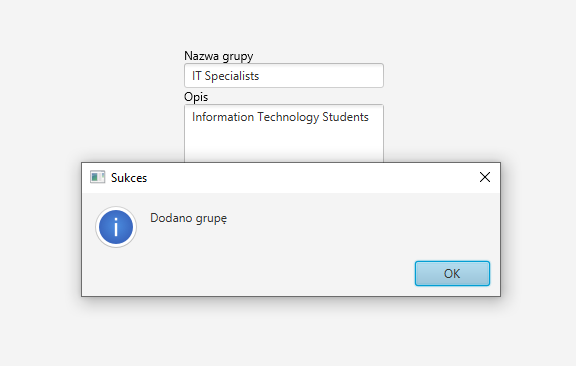

#  Student Attendance System

This project is about an attendance management system designed for both teachers and students. <br>
Teachers can manage students, groups, and attendance records, including marking students as present, late, or absent. <br>
They can also add or remove students and groups, assign students to groups, and schedule attendance sessions. <br>
Students can log in using their student ID to view their group information and attendance records. <br>
The system includes a desktop application for teachers and a mobile-friendly web interface for students, with a central server handling data and communication.

<br>
<br>
<br>

# Teacher's App Functionalities:
1. Manage Students:
   - Add new students
   - Remove students
   - Edit student details
2. Manage Groups:
   - Create new groups
   - Delete groups
   - Assign students to groups
   - Remove students from groups
3. Manage Attendance:
   - Schedule attendance sessions for groups
   - Mark student attendance (Present, Late, Absent)
   - View and edit attendance records

<br>

# Student's App Functionalities:
1. User authentication using student ID
2. View personal details (name, surname, student ID, assigned group)
3. View and browse attendance history
4. Resoponsive design - mobile friendly interface for easy access

<br>
<br>
<br>

# Teacher App Showcase:

## Teacher App - start:
After launching Teacher App, you have button to connect to database.<br><br>
<br><br>

## Teacher App - Groups view:
After connecting to database, first thing you see is `Grupy` View.<br><br>
<br><br>

## Teacher App - adding new group:
After clicking `Stwórz grupę` button, the window changes to adding new group form. After filling all required fields, you can click `Zapisz`. <br><br>
<br><br>

## Teacher App - adding new group confirmation:
After clicking `Zapisz` button, you get a confirmation of the action. <br><br>
<br><br>

## Teacher App - new group added:
Now you can see your new group in the Groups list. <br>
Here in `Operacje` column you have options to add new student to your group (person icon) or to delete the group (trash can icon). <br><br>
<br><br>

## Teacher App - Students view:
You can change you view to Students view by clicking `Studenci` tab in top left corner. <br>
After that you can add new student by clicking `Dodaj studenta` button. <br><br>
<br><br>

## Teacher App - adding new student:
After clicking `Dodaj studenta` button, the window changes to adding new student form. After filling all required fields, you can click `Zapisz`. <br><br>
<br><br>

## Teacher App - adding new student confirmation:
After clicking `Zapisz` button, you get a confirmation of the action. <br><br>
<br><br>

## Teacher App - new student added:
Now you can see your new student in the Students list. <br>
Here in `Operacje` column you have options to remove student from his group (person icon) or to delete the student (trash can icon). <br>
In the example below there are added additional students for presentation purposes. <br><br>
<br><br>

## Teacher App - Terms view:
You can change you view to Terms view by clicking `Terminy` tab in top left corner. <br>
After that you can add new term by clicking `Dodaj termin` button. <br><br>
<br><br>

## Teacher App - adding new term:
After clicking `Dodaj termin` button, the window changes to adding new term form. After filling all required fields and choosing the desired group, you can click `Zapisz`. <br><br>
<br><br>

## Teacher App - adding new term confirmation:
After clicking `Zapisz` button, you get a confirmation of the action. <br><br>
<br><br>

## Teacher App - new term added:
Now you can see your new term in the Terms list. <br>
Here in `Operacje` column you have options to check attendace list for this term (clickboard icon) or to delete the term (trash can icon). <br>
In the example below there are added additional terms for presentation purposes. <br><br>
<br><br>

## Teacher App - adding students to desired group step 1:
After creating your group and adding new students to the system you can add them to your group. <br>
In order to do that you need to click `Grupy` tab in top left corner. <br>
After that click person icon in `Operacje` column. <br><br>
<br><br>

## Teacher App - adding students to desired group step 2:
Now you can see Adding Students To Group view. <br>
Check all students you want to add to your group (hold `Ctrl` key to select multiple of them). <br>
To finish operation click `Dodaj wybranych studentów` button. <br><br>
<br><br>

## Teacher App - adding students to desired group step 3:
Now you can see that the number of students in your group have changed (`Liczba osób` column). <br>
<br><br>

## Teacher App - marking attendace for your student in desired term step 1:
After adding your students to your group you can check attendance for them in desired term. <br>
In order to do that you need to click `Terms` tab in top left corner. <br>
After that click clipboard icon in `Operacje` column. <br><br>
<br><br>

## Teacher App - marking attendace for your student in desired term step 2:
Now you can see Check Students' Attendance view. <br>
Check correct radio button in the `Obecny / Nieobecny / Usprawiedliwiony` column for each student. <br>
To finish operation click `Zapisz` button. <br><br>
<br><br>

<br>
<br>
<br>

# Student App Showcase:

## Student App - start:
After connecting to Student App's website address, you need to enter your Student's ID and click `Zaloguj się` button.<br><br>
<br><br>

## Student App - bad login:
If you entered bad login you will get simple response from the website informing you about that. <br><br>
<br><br>

## Student App - correct login:
If you entered correct login you will be redirected to your page with details about your attendance. <br>
Here you can also see some information about yourself like *Name*, *Surname*, *Student ID* or *Group* <br><br>
<br><br>

## Student App - correct login but different students:
Now you can see all your student that you have created and their attendance info <br><br>
<br><br>
<br><br>

<br>
<br>
<br>


# App Setup:

## Required Technologies and Programs:
1. Node.js added to PATH (at least version 21.7.3)
2. Java added to PATH (version 21)
3. Some way of starting MySQL database and creating a schema f.e.:
   - XAMPP and using in-build PhpMyAdmin
   - Docker Desktop and MySQL container (you can create schema in IntelliJ and launch backend there)
4. Intellij (tested in version 2024.1.2)

<br><br>

## Instalation steps:
1. Launch MySQL service on 3306 port in desired app (f.e. Docker Desktop)
2. With Intellij open folder `backend` and go to `/src/main/java/com/attendance_backend` and run file `BackendApplication.java`
3. In another Intellij window open folder `teacher-client` and go to `/src/main/java/teacherclient` and run file `MainApplication.java`
4. In terminal/CMD go to location of `student-client` and run these commands:
```
npm install
npm run dev
```

<br><br>

## Bugs:
1. If you get *"no JDK configured error"*, your Java is not added to PATH. Add it to PATH and retry all of the installation steps.
2. If you get *"npm command is unknown"* or something like that, your Node.js is not added to PATH. Add it to PATH and retry commands containing `npm`.
3. If you can't connect to server/database, check if your Backend launched properly, and hasn't shutted down. If it's still working check if your MySQL port is set to 3306.


